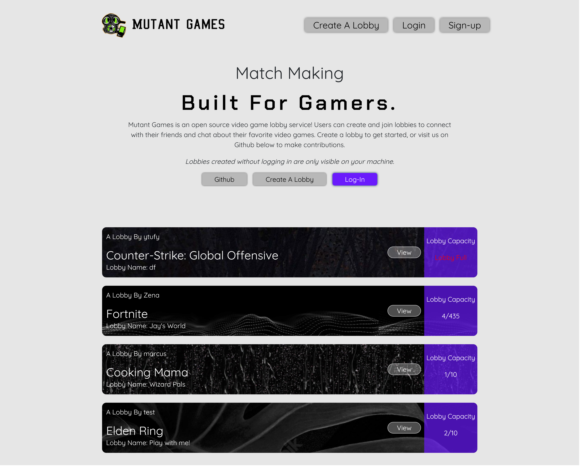
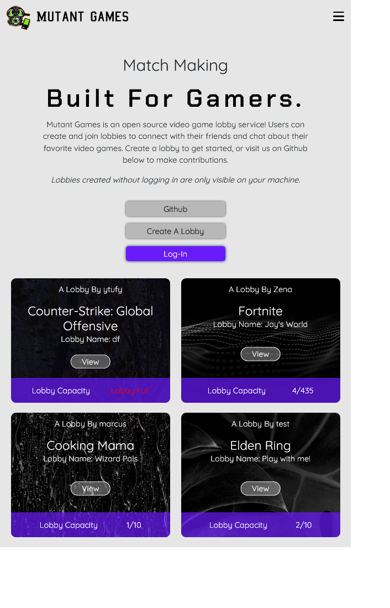

# Mutant Games

Mutant Games is an open source video game lobby service! Users can create and join lobbies to connect with their friends and chat about their favorite video games.

## Screenshots:

Desktop Home Landing Page




Fully Responsive w/ Hamburger Menu



## Technologies Used:

This full-stack MERN application was built using:


## Next Steps:

On the next version of Mutant Games, we are excited to introduce real-time communication via Socket.io!  We will also be implementing the ability for users to keep up with their friend's with an "Add Friend" feature.

## How To Contribute:

To run the project locally:

1. Clone and initiate the [back-end repository](https://github.com/Team-Mutant/Mutant-games-back-end) (following the step-by-step setup guide in the README).

2. Navigate to the directory you want to clone this app into and run the command.

 ```bash 
 git clone git@github.com:Team-Mutant/Mutant-games-front-end.git
 ```

3. After cloning the front-end project directory, run the command.

```bash
touch .env
```

4. Add the following line of code to the .env file you just created.

```bash
REACT_APP_BACKEND_SERVER_URL=http://localhost:3001
```

5. Install all dependencies by running the command.

```bash
npm i
```

6. Spin up the app by running the command.

```bash
npm start
```

## The Team:

Koffi Hessou - Git Manager, Visionary

Sun Hwang - SCRUM Manager, Organization Lead

Teal Ewer - Database Manager, Documenter

Zena Endrias - Front End Lead, Designer