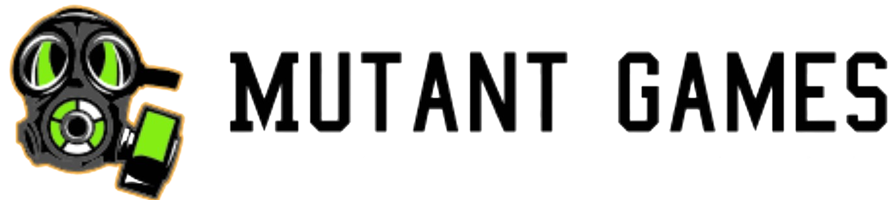
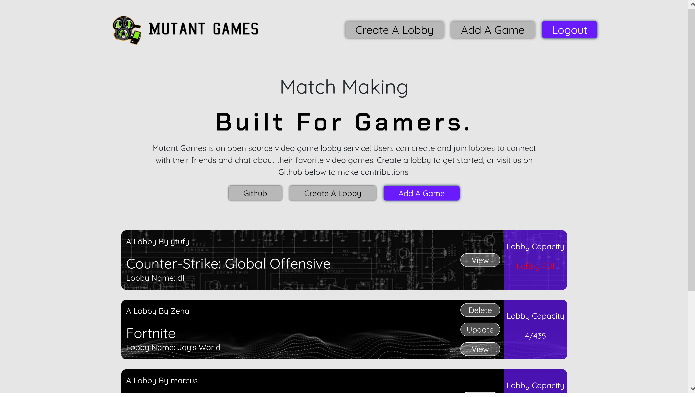

<h1 align="center">Welcome to Mutant Games</h1>
<p align="center"> A Full Stack & Open Source Video Game Lobby Service </p>
<p align="center">
  
</p>
<p align="center">


  
</p>
<p align="center">
  
</p>

<p align="center">There are 201 Million gamers in the United States alone. Many of those gamers play online games with friends and fellow game enthusiasts. Mutant Games is a platform for gamers to meet new friends with common interests. Users can create and join lobbies to connect with their friends and chat about their favorite video games.
<p>

<h1 align="center">Key Features 🔑</h1>

<h3>JWT Authentication</h3>
<h3>Full CRUD Functionality</h3>
<h3>Bcrypt Password Hashing & Salting</h3>
<h3>Message Board</h3>
<h3>Search Feature For Games in The Database</h3>
<h3>Mobile Responsive</h3>

<h1 align="center">Future Plans 🏁</h1>
<h3>Friend Requests</h3>
<h3>Socket.io Real-Time Chat</h3>
<h3>UI Beautification</h3>
<h3>Discord OAuth Integration</h3>

<h1 align="center">Contribute 🤩</h1>


To run the project locally:

1. Clone and initiate the [back-end repository](https://github.com/Team-Mutant/Mutant-games-back-end) (following the step-by-step setup guide in the README).

2. Navigate to the directory you want to clone this app into and run the command.

 ```bash 
 git clone git@github.com:Team-Mutant/Mutant-games-front-end.git
 ```

3. After cloning the front-end project directory, run the command.

```bash
touch .env
```

4. Add the following line of code to the .env file you just created.

```bash
REACT_APP_BACKEND_SERVER_URL=http://localhost:3001
```

5. Install all dependencies by running the command.

```bash
npm i
```

6. Spin up the app by running the command.

```bash
npm start
```
<h1 align="center">Meet The Team 👨‍💼👩‍💼</h1>

Zena Endrias - Front End Lead, Designer

Koffi Hessou - Git Manager, Visionary

Teal Ewer - Database Manager, Documenter

Sun Hwang - SCRUM Manager, Organization Lead


